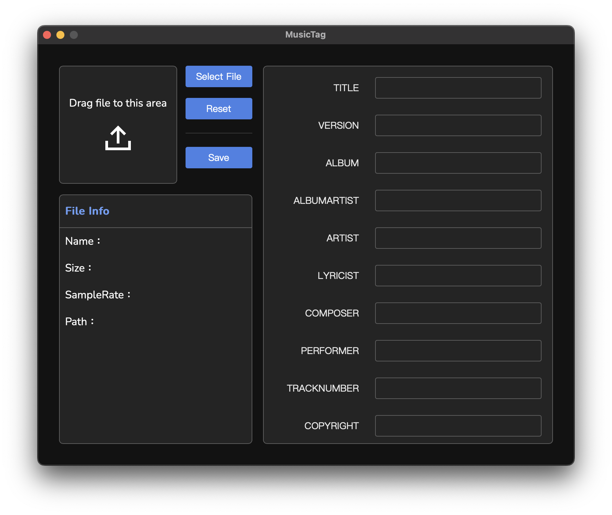

# MusicTag
A tool for editing music tags, currently supporting `.flac` file.



## 📦 Install
Download from [Releases](https://github.com/Adam7066/MusicTag/releases).

### MacOS
**If you encounter the error message `"MusicTag" is damaged and can't be opened. You should move it to the Trash`. while installing software on macOS, it may be due to security settings restrictions in macOS. To solve this problem, please try the following command in Terminal:**
```bash
sudo xattr -r -d com.apple.quarantine /YOUR_PATH/MusicTag.app
```